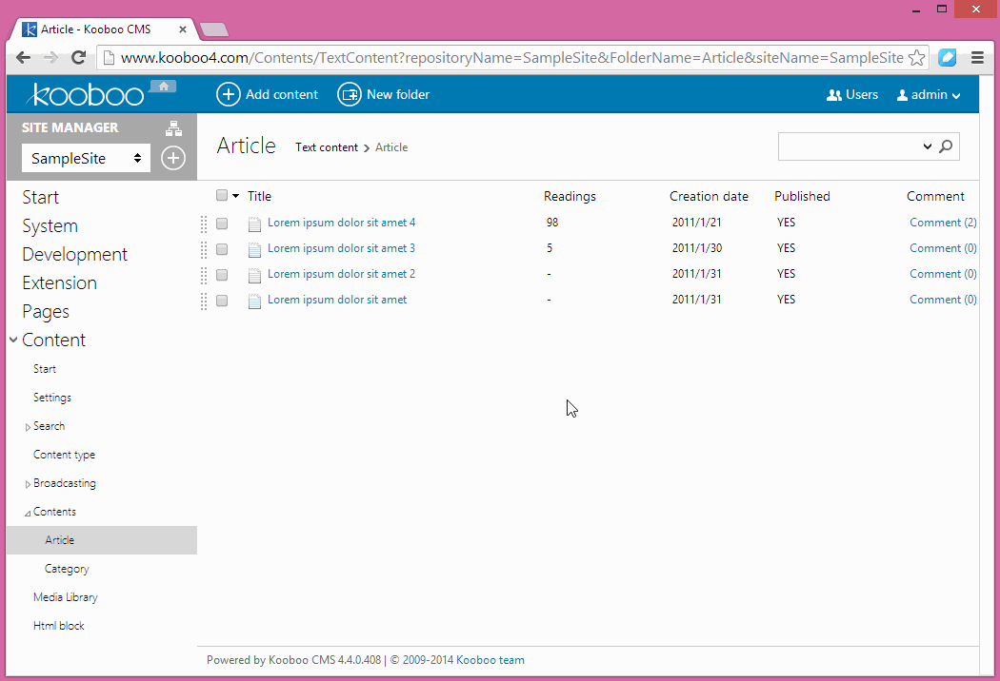

**Kooboo.Toolkits**
=======

Kooboo.CMS.Toolkit
---
>
>The custom tool kit for kooboo cms
>
Extensive expansion toolkits,I believe you will like it.
>
see a demonstration project here:[https://github.com/Tsingbo-Kooboo/KoobooToolkitSampleSite](https://github.com/Tsingbo-Kooboo/KoobooToolkitSampleSite)
>##Easy to use：
>#####Visual Studio:
>To install Kooboo.CMS.Toolkit, run the following command in the  [Package Manager Console](http://docs.nuget.org/docs/start-here/using-the-package-manager-console "Package Manager Console")
>
```
PM> Install-Package Kooboo.CMS.Content.UserKeyGenerator.Chinese
>```
>#####Web server：
>click [here](http://tsingbo-kooboo.github.io/Cms_Data/Sites/Kooboo/Files/packages/Kooboo.CMS.Toolkit.dll "Kooboo.CMS.Toolkit.dll") to download the dll,and copy it to bin folder.
>

Kooboo.CMS.Toolkit.Controls
---

>How to use Cascading Control:
>
1. Add a setting name "Parent" indicate using which parent field in the CustomSetting.
1. Add a setting name "Folder" indicate using which folder as data source in the CustomSetting.
1. The DefaultValue as "Default message to select an option. if you set an empty value then does not shows any initial text.".

Kooboo.CMS.Content.UserKeyGenerator.Chinese
---
>Used in Chinese Sites
>
>用于内容的UserKey生成，将中文字符转成拼音。
>
>##如何使用：
>#####Visual Studio:
>使用nuget安装，安装命令如下：（点击 [查看详情](http://www.nuget.org/packages/Kooboo.CMS.Content.UserKeyGenerator.Chinese/ "http://www.nuget.org/packages/Kooboo.CMS.Content.UserKeyGenerator.Chinese/")）
>
```
PM> Install-Package Kooboo.CMS.Content.UserKeyGenerator.Chinese
>```
>#####服务器：
>点击[这里](http://tsingbo-kooboo.github.io/Cms_Data/Sites/Kooboo/Files/packages/Kooboo.CMS.Content.UserKeyGenerator.Chinese.dll "Kooboo.CMS.Content.UserKeyGenerator.Chinese.dll")下载编译完的dll，将其拷贝到bin目录下即可。
>



Kooboo.Toolkits.Test
---
unit test project